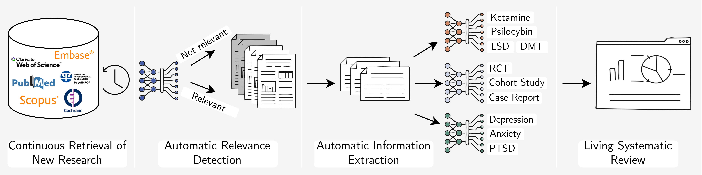

# Projects Description

We are currently working on two different projects:
* P1: Living Systematic Review on Psychedelic Treatments for Psychiatric Disorders: This is small project focusing on a niche area of research. It is a proof of concept of the type of web app and pipeline that we would like to use on a broader scale in future, as in the project below:
* P2: Living Systematic Review on (Drug) Treatments for Neuropsychiatric Disorders: This project aims to provide neuroscientists with streamlined access to comprehensive preclinical and clinical research, enabling informed experimental planning and in-depth evaluation of the neuroscience therapy development pipeline.

## Project components
Our final projects should have the following components. In bracketch is the projects to which this component applies to:
* **Periodic fetching of newest publication abstracts** (P1,2): We will periodically (e.g. every week) fetch the abstracts and metadataof the newest publications. For now our target database is Pubmed, but more could be included inthe future.
* **Periodic fetching of newest publications full-text** (P2): We will periodically (e.g. every week) fetch available full-texts of the newest publications.
* **Periodic fetching of newest clinical trials** (P2): We will periodically (e.g. every week) fetch the lates clinical trial details from ClinicalTrials.gov.
* **Relevance Detection** (P1,2): A language model classifies the new publication as relevant/not relevant for the project
* **Classification and NER** (P1,2): The abstract (+ method section) of the fetched publication are passed through several fine-tuned BERT models for classification and NER
* **Continuously populated database** (P1,2): The publications, the results of the relevance detection plus the classification and NER results are saved in database
* **Front-End** (P1,2): Displays the research and classification/NER results in interactive graphs

Here is a schematic of what the pipeline would look like for the Psynamic Project (note: the database is not explicitly mentioned in this visualisation):

## What we have developed/are developing:
* **Fine-tuned models**: fine-tuned models for relevance detection, classifciation and NER; saved as Pytorch Checkpoints
* **Inference scripts**: Python code to load the models and run inference
* **Database**: setup a Postgres databases locally
> here is the link to an ER Diagram (on Miro): https://miro.com/app/board/uXjVLLEtnVU=/?share_link_id=52084304523
* **Fetching newst publication data**: a python script to fetch newest research via API and writing it into the database
* **Frontend**: web app created with [Dash](https://dash.plotly.com/) (by Plotly)
> a very rough protoype with flat data input (s. `app_dash/data/`, will be replaced with the Postgres database in future) for the PsyNamic project can be found in `app_dash/` in this repo. 

Here are some impressions:

  

## We need infrastructure & support with
* **Storing Database**: a place to store the database
* **Storing Models**: a place to store fine-tuned model weights
* **Scheduling data fetching & model inference**: automatically, periodically running python script to fetch data and run inference
* **Webhosting**: a server or service to host our front-end
* **Long-Term Support**

